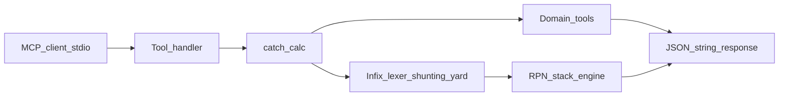
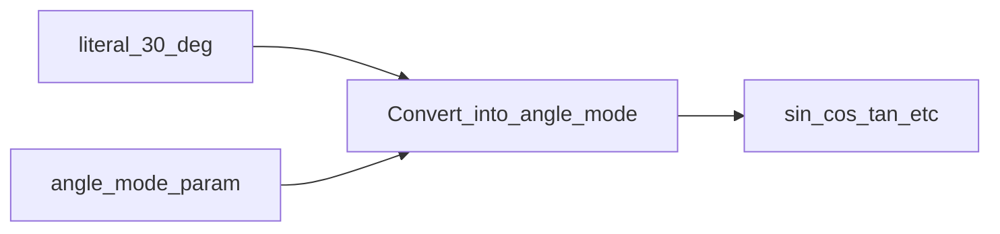
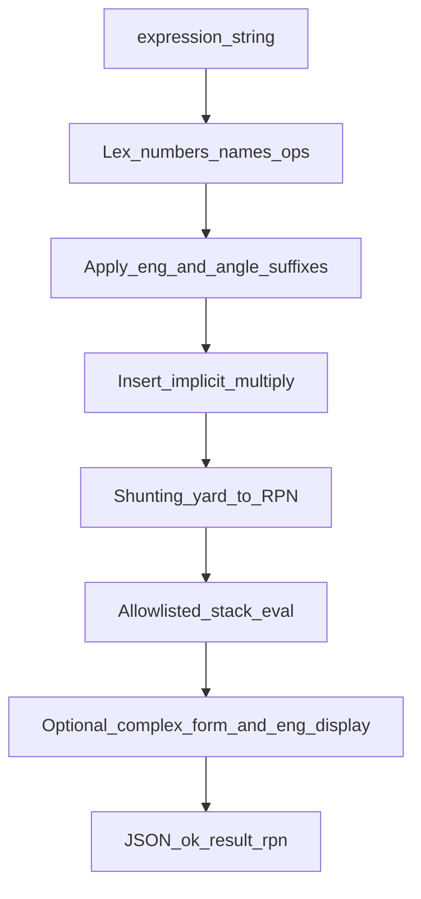
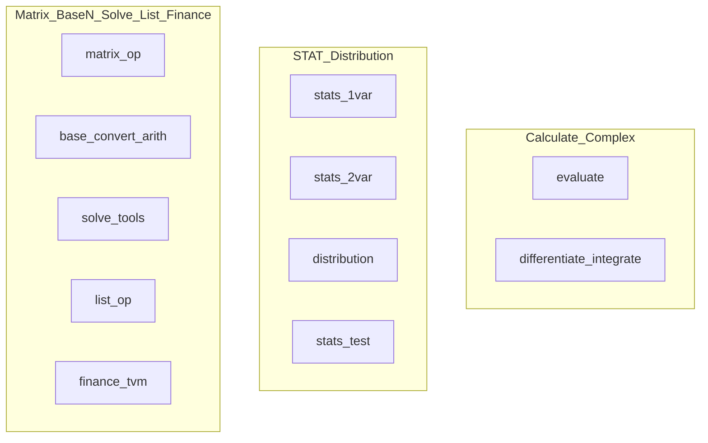
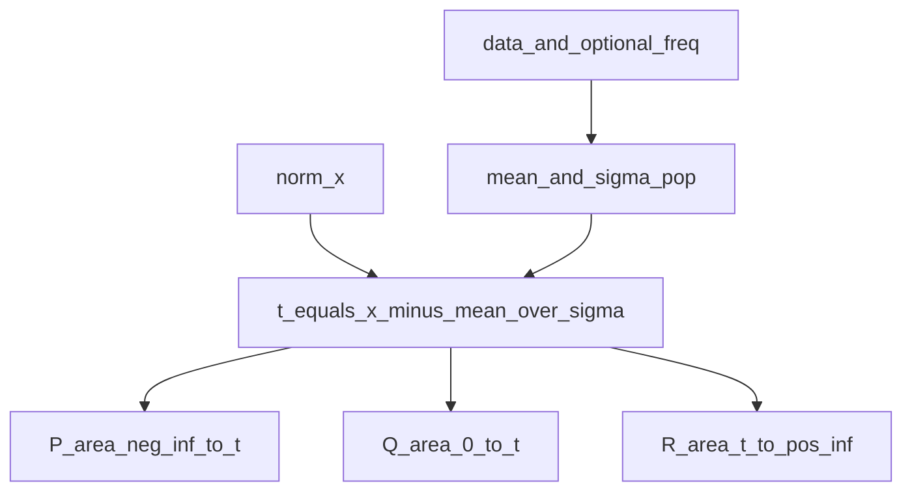

# mcp_calculator

stdio MCP server that gives LLMs a **scientific calculator with normal infix maths** (e.g. `90+(40-30)`, `sin(30)`, `x^2-2`). Expressions are parsed safely, converted internally to Reverse Polish Notation, and evaluated by a stack machine over allowlisted operators and constants — **no Python `eval`/`exec`** — so agents can verify numeric work without inventing answers.

**Runtime:** Python ≥3.10, dependency `mcp≥1.0`. Numerics use IEEE-754 `float` / `complex` via the standard `math` and `cmath` libraries (no SymPy, NumPy, or mpmath).

## Table of contents

- [Install / use](#install--use-cursor--claude-desktop)
- [How the calculator works](#how-the-calculator-works)
  - [Expression grammar](#expression-grammar)
  - [Angle mode and suffixes](#angle-mode-and-suffixes)
  - [Engineering symbols](#engineering-symbols)
  - [Complex and polar](#complex-and-polar)
  - [Evaluate pipeline](#evaluate-pipeline)
- [Calculator modes → MCP tools](#calculator-modes--mcp-tools)
- [MCP request and response conventions](#mcp-request-and-response-conventions)
- [Tools reference](#tools-reference)
- [Operator / function reference](#operator--function-reference)
- [Constants reference](#constants-reference)
- [Unit conversions](#unit-conversions)
- [Precision](#precision)
- [Limitations and safety](#limitations-and-safety)
- [Manual coverage gaps](#manual-coverage-gaps)
- [Possible future enhancements](#possible-future-enhancements)
- [Tests](#tests)

---

## Install / use (Cursor / Claude Desktop)

From GitHub:

```json
{
  "mcpServers": {
    "mcp_calculator": {
      "command": "uvx",
      "args": ["--from", "git+https://github.com/mAd-DaWg/mcp_calculator", "mcp-calculator"]
    }
  }
}
```

Local clone:

```bash
pip install -e ".[dev]"
```

```json
{
  "mcpServers": {
    "mcp_calculator": {
      "command": "python",
      "args": ["-m", "mcp_calculator"],
      "cwd": "/path/to/mcp_calculator"
    }
  }
}
```

Entry points: console script `mcp-calculator`, or `python -m mcp_calculator`. Transport is **stdio** only (no HTTP port or env-based precision flags).

---

## How the calculator works



Every tool goes through an error wrapper (`catch_calc`): failures come back as JSON with `ok: false`, never as a crashed process. From there, a call either:

- parses an infix expression (`evaluate` and tools that take `f(x)`), or
- runs a dedicated handler (matrix, stats, solve, BASE-N, distribution, LIST, finance, units, …).

Mode choices (angle unit, regression model, distribution type, which TVM unknown to solve, …) are **tool parameters**. Some limits are fixed (for example Base-N is always **32-bit**) and are called out in the tool descriptions.

This server aims to cover ordinary scientific-calculator maths and common extras (stats, matrices, finance, …). Interactive calculator UI (screen formatting, graphing viewport, onboard programming IDE) is out of scope.

### Expression grammar

| Construct | Example |
| --- | --- |
| Arithmetic | `90+(40-30)`, `2+3*4` |
| Powers | `2^10`, `2**3` (same as `^`) |
| Unary minus | `-5`, `2*-3`; `-2^2` → `-4` |
| Functions | `sin(30)`, `sqrt(9)`, `abs(x)`, `engshift(1234,-1)` |
| Multi-arg | `atan2(y,x)`, `log(10,100)`, `cmplx(3,4)`, `polar(r,theta)` |
| Factorial | `5!` |
| Constants | `pi/6`, `qe` |
| Bindings | `variables={"A":2,"B":3}` with expression `A+B` |
| Variable `x` | calculus / roots / Σ / Π / table |
| Implicit `*` | `2pi`, `2(3+4)`, `(1+2)(3)`, `2x` |

**Precedence (tightest last):** `+` `-` → `*` `/` `%` → unary `-` and `∠` → `^` → postfix `!`. `^` is right-associative.

### Angle mode and suffixes

Pass `angle_mode` on the tool (`rad` | `deg` | `grad`). It affects circular trig (`sin`, `cos`, `tan`, inverses, `sec`/`csc`/`cot`, `atan2`, `arg`). Hyperbolic functions ignore angle mode.

Mid-expression **angle suffixes** convert a literal into the current `angle_mode` before evaluation:

| Suffix | Meaning |
| --- | --- |
| `°` or `deg` | value is in degrees |
| `r` or `rad` | value is in radians |
| `g` or `grad` | value is in gradians |



Example: `sin(30°)` with `angle_mode=rad` converts 30° → π/6, then takes sine → ~0.5. Mid-expression `RAD`/`DEG`/`GRAD` **tokens** are not supported — use the tool parameter.

### Engineering symbols

Glued SI prefixes after a real literal (engineering symbols):

`f` `p` `n` `u`/`μ` `m` `k` `M` `G` `T` `P` `E`

Examples: `500k` → 500000, `3μ` → 3e-6, `999k+25k` → 1024000.

- Infix: `engshift(x, n)` multiplies by `1000^n` (ENG / ENG← style).
- Tools: `eng_format`, `eng_shift`.
- `evaluate(..., eng_symbols=true)` adds an `eng` object (`significand`, `exponent`, `symbol`, `display`) for real results.

Note: glued `2m` is **milli** (0.002). For a binding named `m`, write `2*m` or `2 m`.

### Complex and polar

| Form | Example |
| --- | --- |
| Rectangular pack | `cmplx(3,4)`, `abs(cmplx(3,4))` |
| Polar **input** literal | `2∠90` (θ uses `angle_mode`) |
| Polar function | `polar(2, 90)` same meaning |
| Output form | `complex_form=rectangular` → `{re,im}`; `polar` → `{r,theta,unit}` |

### Evaluate pipeline



Higher-level tools (matrix, stats, solve, BASE-N, units, …) use dedicated algorithms; `differentiate`, `integrate`, `solve_root`, Σ/Π/table evaluate **infix** in `x`.

---

## Calculator modes → MCP tools

Modes map to tools; menu/editor choices are tool parameters. Defaults are overridable.



| Calculator mode | MCP tool(s) | Enterable / selectable inputs |
| --- | --- | --- |
| Calculate | `evaluate`, `differentiate`, `integrate`, `summation`, `product`, `factorize`, `fmin`/`fmax`, `pol`, `rec`, `dms_*`, `eng_format`, `eng_shift` | expression; `angle_mode`; `complex_form`; `variables`; `eng_symbols`; eng/angle/polar syntax; calc `h`/`tol`; Σ/Π bounds |
| Complex | `evaluate` | `complex_form`; polar input `r∠θ` |
| Base-N | `base_convert`, `base_arith` | value/a/b, bases 2/8/10/16, op incl. `xnor`/`neg` — **width fixed 32-bit** |
| Matrix / Vector | `matrix_op` | `op` (`ref`≠`rref`, `unit`, `eigen`, …), matrices/vector/`n`, `angle_mode` for angle |
| Statistics | `stats_1var`, `stats_2var` | data; **`model`**; optional `freq`, `predict_*`; `norm_x` → `t`/`P`/`Q`/`R` |
| Distribution | `distribution` | **`type`** + all variables (incl. `norm_p`/`norm_q`/`norm_r`, tails, …) |
| Table | `table` | f, optional g, start, end, step |
| Equation / Func | `solve_linear`, `solve_polynomial`, `solve_root` | coeffs / expression; `allow_complex`; `angle_mode` on root |
| Inequality | `solve_inequality` | coefficients, **`relation`** |
| Ratio | `solve_ratio` | a,b,c,d + **`solve_for`** |
| Spreadsheet | — | Possible future enhancement; use `stats_*` / `table` / `evaluate` meanwhile |
| LIST | `list_op` | `seq`, `cumsum`, `sort_a`, `sort_d`, `delta` |
| Finance TVM | `finance_tvm` | `solve_for` N\|I\|PV\|PMT\|FV + other four values |
| STAT TESTS | `stats_test` | z/t/prop/anova/linreg_ttest + editor fields |
| Setup | per-call params | Defaults overridable; Pol/Rec default `deg`; most others default `rad` |

`stats_2var` **model**: `linear`, `quadratic`, `logarithmic`, `exp`, `abexp`, `power`, `inverse`, `cubic`, `quartic`, `logistic`, `medmed`.

`distribution` **type**: `normal_pd`/`cd`, `inverse_normal` (+ `tail`), `binomial_*`, `inverse_binomial`, `poisson_*`, `geometric_*`, `t_*`, `chi2_*`, `f_*`, `norm_p`/`norm_q`/`norm_r`.

---

## MCP request and response conventions

Every tool returns a **JSON string**. The MCP layer delivers that string as tool-result text. Agents should `JSON.parse` it.

### Success shape

```json
{"ok": true, "...": "tool-specific fields"}
```

### Failure shape

```json
{
  "ok": false,
  "error": "<code>",
  "message": "human-readable explanation",
  "hint": "how to fix the call",
  "example": "optional",
  "did_you_mean": "optional"
}
```

On `ok: false`, read **`message`**, **`hint`**, and when present **`example`** / **`did_you_mean`** before retrying — those fields say what to fix. Discovery tools (`list_operations`, `list_constants`, `list_unit_conversions`) help recover from unknown tokens. Agents see tool **docstrings** and server **instructions** (When/Params/Example), not this README.

### Illustrative MCP `tools/call` envelope

Clients send JSON-RPC over stdio. Example call for `evaluate`:

**Request**

```json
{
  "jsonrpc": "2.0",
  "id": 1,
  "method": "tools/call",
  "params": {
    "name": "evaluate",
    "arguments": {
      "expression": "90+(40-30)",
      "angle_mode": "rad"
    }
  }
}
```

**Decoded tool payload** (the string inside the tool result content):

```json
{
  "ok": true,
  "result": 100.0,
  "expression": "90+(40-30)",
  "angle_mode": "rad",
  "rpn": "90 40 30 - +"
}
```

Below, examples show the **arguments object** and the **parsed JSON response** — what agents reason over after the MCP wrapper.

---

## Tools reference

When this server is connected over MCP, the model sees each tool’s **description** (from the Python docstrings in `server.py`) plus the server **instructions** — not this README. Keep those in sync when changing behaviour.

| Tool | Purpose |
| --- | --- |
| `evaluate` | Main calculator: infix; eng/`°`/`r`/`g`/`r∠θ`; `variables`; `eng_symbols` |
| `list_operations` | Discover available operators and function names |
| `list_constants` | Discover math/physics constant names and values |
| `list_unit_conversions` | Discover supported unit conversion ids |
| `matrix_op` | Matrix and vector algebra (det, inv, ref, rref, unit, eigen, …) |
| `stats_1var` | 1-VAR stats (+ optional FREQ; optional `norm_x` → `t`/`P`/`Q`/`R`) |
| `stats_2var` | Two-variable stats and selectable regression models |
| `solve_linear` | Solve a system of linear equations |
| `solve_root` | Find a numeric root of f(x) = 0 |
| `solve_polynomial` | Find roots of a polynomial (degree 1–4) |
| `solve_inequality` | Solve polynomial inequality with relation |
| `solve_ratio` | Solve a:b = c:d for one unknown |
| `base_convert` | Convert integers between binary/octal/decimal/hex (32-bit) |
| `base_arith` | Integer arithmetic and bitwise ops in a chosen base |
| `differentiate` | Approximate the derivative of f(x) at a point |
| `integrate` | Approximate a definite integral of f(x) |
| `summation` | Σ of f(x) from start to end |
| `product` | Π of f(x) from start to end |
| `factorize` | Prime factorization (integer FACT) |
| `fmin` / `fmax` | Approximate min/max of f(x) on an interval |
| `pol` / `rec` | Rectangular ↔ polar coordinates |
| `dms_to_decimal` / `decimal_to_dms` | Sexagesimal ° ′ ″ conversion |
| `eng_format` / `eng_shift` | Engineering display / ×1000ⁿ shift |
| `distribution` | Normal / binomial / Poisson / geometric / t / χ² / F (+ `norm_p`/`q`/`r`) |
| `stats_test` | STAT TESTS (z/t/prop/ANOVA/LinRegTTest) |
| `list_op` | LIST seq / cumsum / sort / ΔList |
| `finance_tvm` | TVM solver (N, I%, PV, PMT, FV) |
| `table` | Generate f(x) [and g(x)] values by start/end/step |
| `convert_unit` | Convert a value between listed measurement units |

### `evaluate`

The primary tool for checking arithmetic and scientific expressions. Pass ordinary infix maths (parentheses, precedence, functions, constants). The server converts to RPN internally and returns the numeric result plus the internal `rpn` form for transparency. See [Evaluate pipeline](#evaluate-pipeline) for the parse/eval flow.

| Parameter | Type | Default | Description |
| --- | --- | --- | --- |
| `expression` | string | required | Infix expression |
| `angle_mode` | string | `"rad"` | `rad`, `deg`, or `grad` |
| `complex_form` | string | `"rectangular"` | `rectangular` (a+bi) or `polar` (r∠θ) for complex results |
| `variables` | object | optional | Name→float bindings (e.g. `{"A":2,"B":3}` with `A+B`) |
| `eng_symbols` | bool | `false` | If true, real results include an `eng` display object |

**Arguments**

```json
{"expression": "90+(40-30)", "angle_mode": "rad"}
```

**Response**

```json
{
  "ok": true,
  "result": 100.0,
  "expression": "90+(40-30)",
  "angle_mode": "rad",
  "rpn": "90 40 30 - +"
}
```

**Degrees / grads**

```json
{"expression": "sin(30)", "angle_mode": "deg"}
```

```json
{
  "ok": true,
  "result": 0.49999999999999994,
  "expression": "sin(30)",
  "angle_mode": "deg",
  "rpn": "30 sin"
}
```

(`sin(50)` with `angle_mode=grad` likewise yields ~0.5.)

**Angle suffix** (convert into current `angle_mode`):

```json
{"expression": "sin(30°)", "angle_mode": "rad"}
```

**Engineering suffixes**

```json
{"expression": "500k+10M"}
```

```json
{"ok": true, "result": 10500000.0, "expression": "500k+10M", "angle_mode": "rad", "rpn": "500000 10000000 +", "complex_form": "rectangular"}
```

With `eng_symbols: true`, a real result also includes `"eng": {"significand": 10.5, "exponent": 6, "symbol": "M", "display": "10.5M"}`.

**Polar complex input**

```json
{"expression": "2∠90", "angle_mode": "deg", "complex_form": "rectangular"}
```

```json
{"ok": true, "result": {"re": 1.2246467991473532e-16, "im": 2.0}, "expression": "2∠90", "angle_mode": "deg", "rpn": "2 90 polar", "complex_form": "rectangular"}
```

**Variables**

```json
{"expression": "A+B", "variables": {"A": 2, "B": 3}}
```

**Complex**

```json
{"expression": "abs(cmplx(3,4))"}
```

```json
{
  "ok": true,
  "result": 5.0,
  "expression": "abs(cmplx(3,4))",
  "angle_mode": "rad",
  "rpn": "3 4 cmplx abs"
}
```

A non-real complex result looks like `"result": {"re": 1.0, "im": 2.0}`. With `complex_form": "polar"` the same value is `"result": {"r": …, "theta": …, "unit": …}`.

**Constants**

```json
{"expression": "sin(pi/6)"}
```

```json
{
  "ok": true,
  "result": 0.49999999999999994,
  "expression": "sin(pi/6)",
  "angle_mode": "rad",
  "rpn": "pi 6 / sin"
}
```

**Error example**

```json
{"expression": "foo"}
```

```json
{
  "ok": false,
  "error": "unknown_token",
  "message": "Unknown name 'foo' at position 0",
  "hint": "Use a constant (list_constants), variable x, or function call like sin(x).",
  "example": "pi/2",
  "did_you_mean": "F",
  "token": "foo",
  "position": 0
}
```

### `list_operations` / `list_constants` / `list_unit_conversions`

Discovery helpers so agents do not guess names. Call these when unsure which operators, physics constants, or unit conversions exist. Each takes no parameters and returns `ok: true` plus an array:

- `list_operations` → `operations[]` with `name`, `arity`, `description`, `angle_sensitive`
- `list_constants` → `constants[]` with `name`, `value`, `unit`, `note`, `codata_year`, optional `catalog_index`
- `list_unit_conversions` → `conversions[]` with `id`, `from`, `to`, plus `factor` or `note` for temperature

See the [operator](#operator--function-reference), [constants](#constants-reference), and [units](#unit-conversions) catalogs below for the full inventories.

### `matrix_op`

Linear algebra on small dense matrices and vectors: add/subtract/multiply, transpose, determinant, inverse, **REF** and **RREF** (distinct), identity, **eigen**, and vector ops (dot, 3D cross, Euclidean norm, angle, **unit** vector). Maximum dimension is **32**.

| Parameter | Type | Description |
| --- | --- | --- |
| `op` | string | `add`, `sub`, `mul`, `transpose`, `det`, `inv`, `identity`, `ref`, `rref`, `eigen`, `dot`, `cross`, `norm`, `angle`, `unit` |
| `matrices` | list | One or two matrices, or two vectors for vector ops |
| `vector` | list of float | Single vector (e.g. for `norm` / `unit`) |
| `n` | int | Size for `identity` |
| `angle_mode` | string | `rad`/`deg`/`grad` for `angle` (default `"rad"`) |

**Determinant**

```json
{"op": "det", "matrices": [[[1, 2], [3, 4]]]}
```

```json
{"ok": true, "op": "det", "result": -2.0}
```

**Vector norm**

```json
{"op": "norm", "vector": [3, 4]}
```

```json
{"ok": true, "op": "norm", "result": 5.0}
```

**Angle** (radians; includes `"unit": "rad"`)

```json
{"op": "angle", "matrices": [[1, 0], [0, 1]]}
```

```json
{"ok": true, "op": "angle", "result": 1.5707963267948966, "unit": "rad"}
```

**Cross product** (requires 3-vectors)

```json
{"op": "cross", "matrices": [[1, 0, 0], [0, 1, 0]]}
```

```json
{"ok": true, "op": "cross", "result": [0.0, 0.0, 1.0]}
```

**Identity** (requires `n`)

```json
{"op": "identity", "n": 2}
```

```json
{"ok": true, "op": "identity", "result": [[1.0, 0.0], [0.0, 1.0]]}
```

### `stats_1var`

One-variable descriptive statistics: count, mean, sum, sum of squares, min/max, Q1/median/Q3, mode, and population/sample variance and standard deviation (max 100 000 points).

| Parameter | Type | Description |
| --- | --- | --- |
| `data` | list of float | Non-empty |
| `freq` | list of float | Optional FREQ column (same length as `data`) |
| `norm_x` | float | Optional STAT Norm Dist input → adds `t`, `P`, `Q`, `R` |

```json
{"data": [1, 2, 3, 4]}
```

```json
{
  "ok": true,
  "n": 4,
  "mean": 2.5,
  "sum": 10.0,
  "sumsq": 30.0,
  "min": 1.0,
  "max": 4.0,
  "median": 2.5,
  "var_pop": 1.25,
  "var_sample": 1.6666666666666667,
  "std_pop": 1.118033988749895,
  "std_sample": 1.2909944487358056
}
```

#### STAT Norm Dist (`norm_x`)

When `norm_x` is set, the tool standardizes against the sample mean and **population** σ, then returns areas P/Q/R:



```json
{"data": [1, 2, 3, 4, 5], "norm_x": 4}
```

```json
{
  "ok": true,
  "n": 5.0,
  "mean": 3.0,
  "std_pop": 1.4142135623730951,
  "norm_x": 4.0,
  "t": 0.7071067811865475,
  "P": 0.7602499389065233,
  "Q": 0.26024993890652326,
  "R": 0.23975006109347674
}
```

(Response also includes the usual 1-VAR fields: `sum`, `sumsq`, quartiles, variance, etc.)
### `stats_2var`

Two-variable statistics and regression. **Select Type is a required choice** via `model` (not hardcoded to linear). Optional FREQ and ŷ/x̂ estimates match STAT Reg.

| Parameter | Type | Default |
| --- | --- | --- |
| `x`, `y` | list of float | required, equal length |
| `model` | string | `"linear"` — see [modes table](#calculator-modes--mcp-tools) |
| `freq` | list of float | optional |
| `predict_y_at` | float | optional → `y_hat` |
| `predict_x_at` | float | optional → `x_hat` / `x_hat1`,`x_hat2` |

```json
{"x": [1, 2, 3], "y": [2, 4, 6], "model": "linear"}
```

```json
{
  "ok": true,
  "n": 3,
  "model": "linear",
  "a": 0.0,
  "b": 2.0,
  "r": 1.0,
  "mean_x": 2.0,
  "mean_y": 4.0,
  "predict_at_mean": 4.0,
  "equation": "y = a + b*x"
}
```

```json
{"x": [1, 2, 3, 4], "y": [1, 4, 9, 16], "model": "quadratic", "predict_y_at": 2}
```

### `solve_linear`

Solves a square system of linear equations **Ax = b** (unique solution when A is invertible). Pass either an augmented matrix or separate coefficient matrix `A` and right-hand side `b`. Uses Gaussian elimination with partial pivoting. Maximum size **n = 32**.

Pass either:

- `coefficients` — augmented matrix `n×(n+1)`, each row `[a_i1, …, a_in, b_i]`, or
- `A` (n×n) and `b` (length n)

```json
{"A": [[2, 1], [1, 3]], "b": [1, 2]}
```

```json
{
  "ok": true,
  "solution": [0.2, 0.6],
  "residual": [0.0, -2.220446049250313e-16],
  "status": "unique"
}
```

### `solve_root`

Finds a real number **x** where an infix expression **f(x) equals zero** (for example √2 from `x^2-2`). Prefer a bracketing interval `[a, b]` (Brent’s method); if you only have a starting guess, Newton’s method is used instead.

| Parameter | Type | Default |
| --- | --- | --- |
| `expression` | string | required — infix in `x` |
| `bracket` | `[a, b]` | preferred |
| `guess` | float | for Newton |
| `angle_mode` | string | `"rad"` |

```json
{"expression": "x^2-2", "bracket": [0, 2]}
```

```json
{
  "ok": true,
  "root": 1.414213562373095,
  "abs_f": 4.440892098500626e-16,
  "iterations": 19,
  "method": "brent",
  "expression": "x^2-2",
  "angle_mode": "rad"
}
```

### `solve_polynomial`

Finds roots of **a₀ + a₁x + … + aₙxⁿ**. Pass `[a0, …, an]` (constant first). **Degree 1–4**. `allow_complex` mirrors complex-solutions On/Off (default `true`).

```json
{"coefficients": [-2, 0, 1], "allow_complex": true}
```

```json
{
  "ok": true,
  "degree": 2,
  "roots": [1.4142135623730951, -1.4142135623730951],
  "coefficients": [-2.0, 0.0, 1.0],
  "allow_complex": true
}
```

### `solve_inequality`

Inequality mode: polynomial with relation `>`, `>=`, `<`, or `<=` (degree 1–4). Coefficients low-to-high like the Coefficient Editor.

```json
{"coefficients": [-1, 1], "relation": ">"}
```

### `solve_ratio`

Ratio mode **a:b = c:d**. Provide three known values; `solve_for` is `a`|`b`|`c`|`d`|`x` (`x` = the single missing slot).

```json
{"a": 2, "b": 3, "d": 6, "solve_for": "c"}
```

```json
{"ok": true, "a": 2.0, "b": 3.0, "c": 4.0, "d": 6.0, "solve_for": "c", "value": 4.0}
```

### `base_convert`

Converts an integer string from one base to another among **2, 8, 10, and 16**, using **32-bit** two’s complement (**fixed** — not a selectable bit width). Pass unsigned-style digit patterns for negatives (e.g. `FFFFFFFF` for −1).

```json
{"value": "FF", "from_base": 16, "to_base": 10}
```

```json
{
  "ok": true,
  "value": "255",
  "decimal": 255,
  "decimal_unsigned": 255,
  "from_base": 16,
  "to_base": 10,
  "bits": 32
}
```

### `base_arith`

Performs integer arithmetic and bitwise operations on values written in a chosen base (2/8/10/16), still in **32-bit** two’s complement. Supports `add`, `sub`, `mul`, `div`, `and`, `or`, `xor`, `xnor`, unary `not`, and unary `neg`. Results wrap at 32 bits; `div` uses signed interpretation.

| Parameter | Type | Default |
| --- | --- | --- |
| `op` | string | `add`, `sub`, `mul`, `div`, `and`, `or`, `xor`, `xnor`, `not`, `neg` |
| `a` | string | required |
| `b` | string | required except for `not` |
| `base` | int | `10` |

```json
{"op": "add", "a": "A", "b": "5", "base": 16}
```

```json
{"ok": true, "op": "add", "result": "F", "decimal_unsigned": 15, "base": 16}
```

### `differentiate`

Approximates the derivative **df/dx** of an infix function of `x` at a given point, using a central finite difference. Use for checking calculus results numerically (not symbolic differentiation). Optional `h` overrides the automatic step size; `truncation_est` is a rough error hint.

| Parameter | Type | Default |
| --- | --- | --- |
| `expression` | string | required — infix in `x` |
| `at` | float | required — point of evaluation |
| `angle_mode` | string | `"rad"` |
| `h` | float | auto: `(1+|x|)·(1e-16)^(1/3)` |

```json
{"expression": "x^3", "at": 2}
```

```json
{
  "ok": true,
  "derivative": 12.000000000147326,
  "at": 2.0,
  "h": 1.3924766500838347e-05,
  "truncation_est": 3.8779838599604476e-10,
  "expression": "x^3",
  "angle_mode": "rad"
}
```

### `integrate`

Approximates the definite integral of an infix function of `x` from `lower` to `upper` using adaptive Simpson quadrature. Use to check ∫f(x) dx numerically. Optional `tol` tightens or loosens the accuracy target; the response includes `error_est` and how many times `f` was evaluated.

| Parameter | Type | Default |
| --- | --- | --- |
| `expression` | string | required — infix in `x` |
| `lower`, `upper` | float | required — integration limits |
| `angle_mode` | string | `"rad"` |
| `tol` | float | `1e-10` |

```json
{"expression": "x^2", "lower": 0, "upper": 1}
```

```json
{
  "ok": true,
  "integral": 0.3333333333333333,
  "lower": 0.0,
  "upper": 1.0,
  "error_est": 0.0,
  "evaluations": 5,
  "expression": "x^2",
  "angle_mode": "rad"
}
```

Caps: recursion depth 40, ≤ 100 000 function evaluations.

### `summation`

Σ: sum an infix expression in `x` for integer index from `start` to `end` inclusive.

```json
{"expression": "x+1", "start": 1, "end": 5}
```

```json
{"ok": true, "sum": 20.0, "expression": "x+1", "index": "x", "start": 1, "end": 5, "angle_mode": "rad"}
```

### `pol` / `rec`

Rectangular ↔ polar. Default `angle_mode` is `"deg"`.

```json
{"x": 2, "y": 2, "angle_mode": "deg"}
```

```json
{"ok": true, "r": 2.8284271247461903, "theta": 45.0, "x": 2.0, "y": 2.0, "angle_mode": "deg"}
```

### `dms_to_decimal` / `decimal_to_dms`

Sexagesimal ° ′ ″ ↔ decimal degrees.

```json
{"degrees": 10, "minutes": 30, "seconds": 0}
```

```json
{"ok": true, "decimal": 10.5, "degrees": 10.0, "minutes": 30.0, "seconds": 0.0}
```

### `distribution`

Distribution mode — pass **`type`** and every variable that type needs (none are hardcoded).

| type | Required inputs |
| --- | --- |
| `normal_pd` | `x`, `sigma`, `mu` |
| `normal_cd` | `lower`, `upper`, `sigma`, `mu` |
| `inverse_normal` | `area`, `sigma`, `mu` (+ optional `tail`) |
| `binomial_pd` / `binomial_cd` | `x`, `n`, `p` (`x` may be a list) |
| `inverse_binomial` | `area`, `n`, `p` |
| `poisson_pd` / `poisson_cd` | `x`, `lambda_` |
| `geometric_*`, `t_*`, `chi2_*`, `f_*` | see tool docstring / `list`-style discovery via errors |
| `norm_p` / `norm_q` / `norm_r` | `x` = standardized **t** (or use `stats_1var` with `norm_x`) |

```json
{"type": "normal_pd", "x": 36, "sigma": 2, "mu": 35}
```

```json
{"type": "norm_p", "x": 1.0}
```

### `eng_format` / `eng_shift`

Engineering display helpers (also available in infix via suffixes and `engshift`):

| Tool | Inputs | Result |
| --- | --- | --- |
| `eng_format` | `value` | significand / exponent / SI symbol / `display` string |
| `eng_shift` | `value`, `steps` (default 1) | `value * 1000^steps` |

```json
{"value": 12345}
```

```json
{"ok": true, "value": 12345.0, "significand": 12.345, "exponent": 3, "symbol": "k", "display": "12.345k"}
```

### `product` / `factorize` / `fmin` / `fmax`

- **`product`** — Π of infix `f(x)` from integer `start` to `end` (same shape as `summation`).
- **`factorize`** — prime factorization of a positive integer (`n`).
- **`fmin` / `fmax`** — approximate min/max of infix `f(x)` on `[lower, upper]` with `angle_mode`.

### `stats_test` / `list_op` / `finance_tvm`

- **`stats_test`** — STAT TESTS: z/t/prop/ANOVA/LinRegTTest; pass the editor fields for the chosen test type.
- **`list_op`** — LIST: `seq`, `cumsum`, `sort_a`, `sort_d`, `delta`.
- **`finance_tvm`** — solve for one of `N`, `I`, `PV`, `PMT`, `FV` given the other four.

### `table`

Table mode: evaluate `expression` (and optional `expression2` as g) from `start` to `end` by `step`.

```json
{"expression": "2*x", "start": 0, "end": 2, "step": 1, "expression2": "x^2"}
```

### `convert_unit`

Converts a numeric value between common measurement units (length, area, volume, mass, pressure, force, energy, power, and temperature). Only pairs listed by `list_unit_conversions` are supported — there is no free-form dimensional analysis. Pass either a `conversion_id` **or** `from_unit` + `to_unit`. Full id list: [Unit conversions](#unit-conversions).

```json
{"value": 1, "conversion_id": "mile_to_km"}
```

```json
{
  "ok": true,
  "value": 1.609344,
  "from_unit": "mile",
  "to_unit": "km",
  "conversion_id": "mile_to_km"
}
```

Temperature example (`100 °C → °F`):

```json
{"value": 100, "conversion_id": "C_to_F"}
```

```json
{"ok": true, "value": 212.0, "from_unit": "C", "to_unit": "F", "conversion_id": "C_to_F"}
```

---

## Operator / function reference

76 operators/functions from the allowlist. In infix, use binary symbols (`+`, `^`, `∠`, …) or **function-call** form `name(args)` matching arity. `angle_sensitive` means circular-trig / mode behavior. Call `list_operations` at runtime for the same data.

### Arithmetic and powers

| Name | Arity | Angle | Description |
| --- | --- | --- | --- |
| `+` | 2 | | Addition |
| `-` | 2 | | Subtraction |
| `*` | 2 | | Multiplication |
| `/` | 2 | | Division |
| `^` | 2 | | Power `a^b` — infix `a^b` or `a**b`; also `pow(a,b)` |
| `pow` | 2 | | Alias for `^` |
| `%` | 2 | | Remainder (fmod); also `mod(a,b)` |
| `mod` | 2 | | Modulo |
| `nroot` | 2 | | `nroot(x,y)` → `y^(1/x)` |
| `neg` | 1 | | Negate (infix unary `-`) |
| `abs` | 1 | | Absolute value / modulus — `abs(x)` |
| `inv` | 1 | | Reciprocal `1/x` — `inv(x)` |
| `sqrt` | 1 | | Square root — `sqrt(x)` |
| `cbrt` | 1 | | Cube root — `cbrt(x)` |
| `sq` | 1 | | Square — `sq(x)` or prefer `x^2` |
| `cube` | 1 | | Cube — `cube(x)` or prefer `x^3` |
| `pct` | 2 | | `x * y / 100` |
| `pct1` | 1 | | `x / 100` |
| `min` | 2 | | Minimum |
| `max` | 2 | | Maximum |
| `hypot` | 2 | | Hypotenuse |
| `sgn` | 1 | | Sign (−1, 0, 1) |

### Exponentials and logarithms

| Name | Arity | Description |
| --- | --- | --- |
| `exp` | 1 | `e^x` |
| `exp10` | 1 | `10^x` |
| `ln` | 1 | Natural log |
| `log10` | 1 | Log base 10 |
| `log2` | 1 | Log base 2 |
| `log` | 2 | `log(b,a)` → log base b of a |

### Circular trigonometry (angle mode)

| Name | Arity | Description |
| --- | --- | --- |
| `sin` / `cos` / `tan` | 1 | Forward trig |
| `asin` / `acos` / `atan` | 1 | Inverse → angle mode |
| `atan2` | 2 | `atan2(y,x)`: `y x atan2` |
| `sec` / `csc` / `cot` | 1 | Reciprocal trig |

### Hyperbolic (ignore angle mode)

| Name | Arity | Description |
| --- | --- | --- |
| `sinh` / `cosh` / `tanh` | 1 | Hyperbolic |
| `asinh` / `acosh` / `atanh` | 1 | Inverse hyperbolic |
| `sech` / `csch` / `coth` | 1 | Reciprocal hyperbolic |

### Angle conversion helpers

| Name | Arity | Description |
| --- | --- | --- |
| `d2r` / `r2d` | 1 | Degrees ↔ radians |
| `g2r` / `r2g` | 1 | Grads ↔ radians |
| `d2g` / `g2d` | 1 | Degrees ↔ grads |

### Rounding and integers

| Name | Arity | Description |
| --- | --- | --- |
| `floor` / `ceil` / `round` | 1 | Floor / ceiling / nearest |
| `trunc` | 1 | Truncate toward zero |
| `frac` | 1 | Fractional part |
| `int` | 1 | Integer part (floor) |
| `fact` | 1 | Factorial `n!` (n ≤ 170) — infix `n!` or `fact(n)` |
| `nPr` / `nCr` | 2 | Permutations / combinations — `nPr(n,r)`, `nCr(n,r)` (n ≤ 1000) |
| `gcd` / `lcm` | 2 | GCD / LCM |

### Random

| Name | Arity | Description |
| --- | --- | --- |
| `rand` | 0 | Uniform float in `[0, 1)` — `rand()` |
| `randint` | 2 | Random int inclusive — `randint(a,b)` |

### Complex

| Name | Arity | Angle | Description |
| --- | --- | --- | --- |
| `cmplx` | 2 | | Pack re, im → complex — `cmplx(re,im)` |
| `polar` | 2 | yes | `r∠θ` → complex (θ uses `angle_mode`) — infix `2∠90` or `polar(2,90)` |
| `re` / `im` | 1 | | Real / imaginary part — `re(z)`, `im(z)` |
| `conj` | 1 | | Conjugate — `conj(z)` |
| `arg` | 1 | yes | Argument (angle mode) — `arg(z)` |

### Engineering

| Name | Arity | Description |
| --- | --- | --- |
| `engshift` | 2 | `x * 1000^n` — `engshift(1234, 1)` |

### Mode switches

`RAD` / `DEG` / `GRAD` exist in the internal op table (arity 0) but are **not** part of the infix grammar. Set `angle_mode` on the tool instead. Mid-expression angle **suffixes** (`°`/`r`/`g`) are supported — see [Angle mode and suffixes](#angle-mode-and-suffixes).

Function/operator names are matched case-insensitively.

---

## Constants reference

Physics values follow **NIST CODATA 2022** (exact SI values where applicable). Use them as names in infix, e.g. `c*qe`.

**Naming pitfalls**

- Elementary charge is **`qe`** (or `echarge`). Token **`e`** is Euler’s number.
- Classical electron radius is **`r_e`**. Token **`re`** is the real-part operator.
- Case-insensitive lookup is disabled for ambiguous pairs that collide when lowercased (e.g. `muN` vs `mun`). Prefer the exact spelling from this table or `list_constants`.

| Token | Value | Unit | Note |
| --- | --- | --- | --- |
| `pi` | 3.141592653589793 | 1 | Archimedes' constant |
| `e` | 2.718281828459045 | 1 | Euler's number |
| `euler` | (alias of `e`) | 1 | Alias for `e` |
| `tau` | 6.283185307179586 | 1 | `2*pi` |
| `phi` | 1.618033988749895 | 1 | Golden ratio |
| `inf` | +∞ | 1 | Positive infinity (ops that produce non-finite results still raise `overflow` on output) |
| `mp` | 1.67262192595e-27 | kg | proton mass |
| `mn` | 1.67492750056e-27 | kg | neutron mass |
| `me` | 9.1093837139e-31 | kg | electron mass |
| `mmu` | 1.883531627e-28 | kg | muon mass |
| `a0` | 5.29177210544e-11 | m | Bohr radius |
| `h` | 6.62607015e-34 | J s | Planck constant (exact) |
| `muN` | 5.0507837393e-27 | J T⁻¹ | nuclear magneton |
| `muB` | 9.2740100657e-24 | J T⁻¹ | Bohr magneton |
| `hbar` | 1.0545718176461565e-34 | J s | reduced Planck constant |
| `alpha` | 7.2973525643e-3 | 1 | fine-structure constant |
| `r_e` | 2.8179403205e-15 | m | classical electron radius |
| `lambdaC` | 2.42631023538e-12 | m | Compton wavelength |
| `gammap` | 2.6752218708e8 | s⁻¹ T⁻¹ | proton gyromagnetic ratio |
| `lambdaCp` | 1.32140985539e-15 | m | proton Compton wavelength |
| `lambdaCn` | 1.31959090382e-15 | m | neutron Compton wavelength |
| `Rinf` | 10973731.568157 | m⁻¹ | Rydberg constant |
| `u` | 1.66053906892e-27 | kg | atomic mass unit |
| `mup` | 1.41060679545e-26 | J T⁻¹ | proton magnetic moment |
| `mue` | −9.2847646917e-24 | J T⁻¹ | electron magnetic moment |
| `mun` | −9.6623653e-27 | J T⁻¹ | neutron magnetic moment |
| `mumu` | −4.49044830e-26 | J T⁻¹ | muon magnetic moment |
| `F` | 96485.3321 | C mol⁻¹ | Faraday constant |
| `qe` | 1.602176634e-19 | C | elementary charge (exact) |
| `echarge` | (alias of `qe`) | C | Alias for `qe` |
| `NA` | 6.02214076e23 | mol⁻¹ | Avogadro constant (exact) |
| `k` | 1.380649e-23 | J K⁻¹ | Boltzmann constant (exact) |
| `k_B` | (alias of `k`) | J K⁻¹ | Alias for `k` |
| `Vm` | 0.02271095464 | m³ mol⁻¹ | molar volume ideal gas (273.15 K, 100 kPa) |
| `R` | 8.314462618 | J mol⁻¹ K⁻¹ | molar gas constant |
| `c` | 299792458 | m s⁻¹ | speed of light (exact) |
| `c1` | 3.741771852e-16 | W m² | first radiation constant |
| `c2` | 1.438776877e-2 | m K | second radiation constant |
| `sigma` | 5.670374419e-8 | W m⁻² K⁻⁴ | Stefan–Boltzmann constant |
| `eps0` | 8.8541878188e-12 | F m⁻¹ | vacuum permittivity |
| `epsilon0` | (alias of `eps0`) | F m⁻¹ | Alias for `eps0` |
| `mu0` | 1.25663706127e-6 | N A⁻² | vacuum permeability |
| `Phi0` | 2.067833848e-15 | Wb | magnetic flux quantum |
| `g` | 9.80665 | m s⁻² | standard gravity |
| `G0` | 7.748091729e-5 | S | conductance quantum |
| `Z0` | 376.730313412 | ohm | vacuum impedance |
| `t0C` | 273.15 | K | 0 °C in kelvin |
| `G` | 6.67430e-11 | m³ kg⁻¹ s⁻² | Newtonian gravitation |
| `atm` | 101325 | Pa | standard atmosphere |

---

## Unit conversions

Linear conversions multiply by a fixed factor. Temperature (`C`/`F`/`K`) uses affine conversion via kelvin.

| Id | From | To | Factor / note |
| --- | --- | --- | --- |
| `in_to_cm` / `cm_to_in` | in ↔ cm | | 2.54 |
| `ft_to_m` / `m_to_ft` | ft ↔ m | | 0.3048 |
| `yd_to_m` / `m_to_yd` | yd ↔ m | | 0.9144 |
| `mile_to_km` / `km_to_mile` | mile ↔ km | | 1.609344 |
| `nmi_to_m` / `m_to_nmi` | nmi ↔ m | | 1852 |
| `pc_to_km` / `km_to_pc` | pc ↔ km | | 3.085677581e13 |
| `acre_to_m2` / `m2_to_acre` | acre ↔ m2 | | 4046.8564224 |
| `ha_to_m2` / `m2_to_ha` | ha ↔ m2 | | 10000 |
| `gal_to_L` / `L_to_gal` | gal ↔ L | | 3.785411784 |
| `floz_to_mL` / `mL_to_floz` | floz ↔ mL | | 29.5735295625 |
| `oz_to_g` / `g_to_oz` | oz ↔ g | | 28.349523125 |
| `lb_to_kg` / `kg_to_lb` | lb ↔ kg | | 0.45359237 |
| `atm_to_Pa` / `Pa_to_atm` | atm ↔ Pa | | 101325 |
| `mmHg_to_Pa` / `Pa_to_mmHg` | mmHg ↔ Pa | | 133.322387415 |
| `lbf_to_N` / `N_to_lbf` | lbf ↔ N | | 4.4482216152605 |
| `kgf_to_N` / `N_to_kgf` | kgf ↔ N | | 9.80665 |
| `cal_to_J` / `J_to_cal` | cal ↔ J | | 4.184 |
| `hp_to_W` / `W_to_hp` | hp ↔ W | | 745.6998715822702 |
| `C_to_F` / `F_to_C` | C ↔ F | | affine temperature |
| `C_to_K` / `K_to_C` | C ↔ K | | affine temperature |
| `F_to_K` / `K_to_F` | F ↔ K | | affine temperature |

There is no free-form dimensional analysis — only this table.

---

## Precision

All numeric work uses **IEEE-754 double** (`float`) and Python `complex`. There is no arbitrary-precision mode and no Decimal/mpmath backend.

| Mechanism | Threshold / default | Role |
| --- | --- | --- |
| Integer-ish check | `1e-12` | `fact`, `nPr`, `gcd`, etc. |
| Imag → real | imag &lt; `1e-15` | Treat as real in serialization / real-only ops |
| Differentiate step `h` | `(1+\|x\|)·(1e-16)^(1/3)` | Default central-difference step |
| Integrate `tol` | `1e-10` | Adaptive Simpson tolerance (tool arg) |
| Brent root | `tol=2e-12`, max 200 iters | Bracketed root |
| Newton root | `tol=1e-10`, max 100 iters | Guess-based root |
| Linear pivot | ~`1e-14` | Singularity / no unique solution |
| JSON | `allow_nan=False` | Non-finite values are not emitted; ops raise `overflow` instead |

**Practical accuracy:** well-conditioned real arithmetic and trig typically agree with reference values to roughly **1e-9–1e-12** relative. Numerical differentiation, integration, and root-finding are weaker and depend on conditioning, step size, and tolerance — use the returned `truncation_est`, `error_est`, and `abs_f` fields as guidance, not guarantees.

Trig in degrees can show classic float artifacts (e.g. `sin(30°)` → `0.49999999999999994` rather than exact `0.5`).

---

## Limitations and safety

### Hard limits

| Limit | Value |
| --- | --- |
| Expression length | 100 000 characters |
| Token count | 10 000 |
| Factorial | n ≤ 170 |
| nPr / nCr | n ≤ 1000 |
| Matrix / vector / linear system dimension | 32 |
| Stats sample size | 100 000 |
| Polynomial degree | 1–4 |
| BASE-N | bases 2, 8, 10, 16 only; **32-bit two’s complement fixed** (not selectable) |
| Integration | depth ≤ 40; ≤ 100 000 evaluations |
| Summation / table rows | ≤ 100 000 steps |
| Calculus / root variable | only `x` |
| Calculus | numerical only (not symbolic) |
| Units | fixed conversion table only |
| Display Fix/Sci/Norm | not tool inputs — JSON returns full floats |

### Scope boundaries

- Agents write **infix**; RPN is an internal implementation detail (also returned as `rpn` on `evaluate` for transparency).
- Not a CAS: no symbolic simplify, expand, or algebraic rearrange.
- Not arbitrary precision.
- Hyperbolic functions ignore `angle_mode`.
- Mid-expression `RAD`/`DEG`/`GRAD` **tokens** are not supported in infix — use the `angle_mode` parameter. Mid-expression **`°` / `r` / `g`** (and `deg`/`rad`/`grad`) **are** supported and convert into the current angle mode.
- Glued engineering suffix: `2m` means milli (0.002). For a binding named `m`, write `2*m`.
- BASE-N does not accept leading `-`; use 32-bit patterns for negatives, or `base_arith` op `neg`. Bit width is not a parameter.
- Responses never include NaN/Inf JSON numbers; overflow becomes an error object.
- Narrow UI/hardware exclusions: display Fix/Sci/Norm formatting, interactive graph viewport (Y=/TRACE), full calculator-Basic IDE. See [gaps](#manual-coverage-gaps) and [future enhancements](#possible-future-enhancements) for numeric features not built yet.

### Error codes

| Code | Typical cause |
| --- | --- |
| `empty_expression` | Blank expression |
| `invalid_angle_mode` | Not `rad`/`deg`/`grad` |
| `unknown_token` | Bad name, character, function, or matrix/base op |
| `stack_underflow` | Internal evaluation needed more operands |
| `leftover_stack` | Internal evaluation left multiple values |
| `division_by_zero` | `/`, `inv`, base `div`, etc. |
| `domain_error` | Out-of-domain real/complex input |
| `overflow` | Non-finite result, size/bit/token limits |
| `invalid_factorial` / `invalid_combinatorics` / `invalid_integer` | Integer domain violations |
| `invalid_data` | Bad syntax, arity, lists, missing args, bad `h`/`tol` |
| `dimension_error` | Matrix/system shape mismatch |
| `singular_matrix` | Non-invertible matrix |
| `no_unique_solution` | Linear system under/over-determined |
| `no_root` / `convergence_failed` | Root finder failed |
| `invalid_base` | Unsupported base or digits |
| `unknown_conversion` | Bad unit id/pair |
| `internal_error` | Unexpected exception at tool boundary |

### Safety

Expressions are lexed and dispatched through fixed operator and constant registries. There is no Python `eval`/`exec` of user input, and no subprocess invocation for calculation.

---

## Manual coverage gaps

Common scientific calculator coverage is the **minimum floor**. Many former gaps are now implemented (Q1/Q3/mode, Σy…, factorize, Π, fMin/fMax, multi-var `variables`, Base-N `neg`, distribution extras, STAT TESTS, LIST, TVM, eigen, engineering symbols, polar `∠` literals, mid-expression `°`/`r`/`g`, STAT Norm Dist P/Q/R/t). Remaining:

| Gap | Notes |
| --- | --- |
| Spreadsheet | Deferred — see future list |
| Math Box | Dice/coin/number line/unit circle pedagogy |

**Medium gaps:** richer % key patterns, sexagesimal arithmetic in expressions, fuller metric catalog, inequality compound-string form, named MatA–D session.

## Possible future enhancements

| Enhancement | Notes |
| --- | --- |
| Spreadsheet mode | Grid + formulas; workaround via numeric tools today |
| Math Box | Pedagogy / simulation |
| Named MatA–D / MatAns session | Bindings and/or session |
| Interactive graphing / calculator-Basic IDE | Narrow UI exclusions unless requested |
| Plot *data* APIs | Without full viewport |

---

## Tests

```bash
pip install -e ".[dev]"
pytest --cov=mcp_calculator --cov-report=term-missing
```
